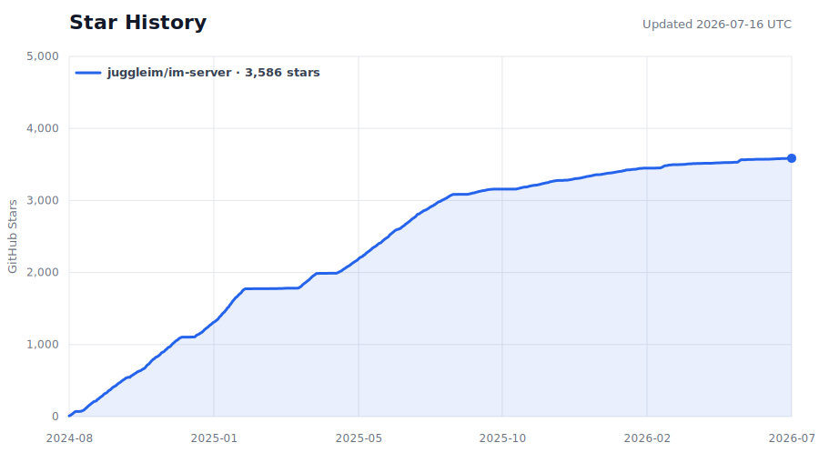

<div align="center">


# JuggleIM

**一个高性能、可扩展的开源 IM 即时通讯系统**

*A high-performance, scalable open-source instant messaging (IM) system.*

[](./LICENSE)
[](https://github.com/juggleim/im-server)
[](https://github.com/juggleim/im-server/actions/workflows/ci.yml)
[](https://github.com/juggleim/im-server/releases)
[](https://github.com/juggleim/im-server/stargazers)
[](https://github.com/juggleim/im-server/network/members)
[](https://github.com/juggleim/im-server/commits)

**简体中文** | **[English](./README.md)**

**[官网](https://www.juggle.im)** ·
**[文档](https://www.juggle.im/docs/guide/intro/)** ·
**[快速部署](https://www.juggle.im/docs/guide/deploy/quickdeploy/)** ·
**[API 文档](https://www.juggle.im/docs/server/api/)** ·
**[提问](https://github.com/juggleim/im-server/discussions/categories/q-a)**

如果这个项目对你有帮助，欢迎点一个 ⭐ **Star** 支持我们，也方便你随时找到它！

</div>

---

## 📖 什么是 JuggleIM

JuggleIM 是一套**开箱即用、可私有化部署**的即时通讯（IM）后端服务。基于 Protobuf + WebSocket 长连接协议，专注于消息的高效分发与可靠存储，帮助你在几分钟内为 App、网站或业务系统搭建起属于自己的聊天能力。

无论是社交产品、客服系统、IoT 设备通信，还是直播弹幕、AI 机器人对话，JuggleIM 都能作为稳定的通讯底座。它天生支持**多租户**，一套服务即可承载多个相互隔离的应用；专业版支持集群横向扩展，可支撑**亿级日活**。

> 想直接体验？按照下方 [Docker 快速开始](#-使用-docker-快速开始)，几分钟内运行完整服务。

## ✨ 核心特性

**🚀 高性能 & 高可用**
- Protobuf + WebSocket 长连接，低流量、高性能，弱网环境下依然保持良好连通性
- 专业版支持集群部署，无限横向扩展，可支撑亿级日活应用
- 支持万人、十万人大群沟通不丢消息，支持无上限直播聊天室

**🔒 安全 & 稳定**
- 使用租户级凭证和客户端 Token 鉴权；生产环境建议通过 HTTPS/WSS 保障传输安全
- 多端同时在线、消息多端同步，确保状态多端一致

**🌍 灵活部署 & 全球服务**
- 支持公有云、私有云、托管云等多种部署形态
- 支持全球链路加速，可服务全球级应用

**🧩 易集成 & 可扩展**
- 提供 Android、iOS、Web、PC、Flutter、鸿蒙等多平台 SDK，附带 Demo 与文档
- 提供丰富的 REST API 和 WebHook，方便与现有系统集成
- 具备 AI 机器人对接能力，可轻松对接大模型
- 自带运维工具和管理后台，简单好维护

## 🗂 目录

- [项目生态](#-项目生态)
- [系统架构](#-系统架构)
- [使用 Docker 快速开始](#-使用-docker-快速开始)
- [手动部署](#-手动部署)
- [创建应用（租户）](#-创建应用租户)
- [业务集成](#-业务服务器--客户端集成)
- [社群讨论](#-社群讨论)
- [Star History](#-star-history)

## 🧬 项目生态

JuggleIM 采用「核心服务 + 业务服务 + 多端 SDK + Demo」的分层架构，各仓库职责清晰，可按需组合、二次开发。

| 仓库 | 说明 |
| :--- | :--- |
| **[im-server](https://github.com/juggleim/im-server/)** | 底层 IM 核心服务，负责消息分发、存储等 IM 相关业务（本仓库） |
| [jugglechat-server](https://github.com/juggleim/jugglechat-server) | Demo 业务服务，负责用户注册/登录、创建群组、添加好友等业务，可在此基础上二开 |
| [jugglechat-server-java](https://github.com/juggleim/jugglechat-server-java) | Demo 业务服务的 Java 版本 |
| [imserver-console](https://github.com/juggleim/imserver-console) | IM 服务的管理后台，用于操作 IM 配置、监控业务量 |
| [imsdk-android](https://github.com/juggleim/imsdk-android) | 安卓端 imsdk，内含 UI Demo，可用于二开 |
| [imsdk-ios](https://github.com/juggleim/imsdk-ios) | iOS 端 imsdk，内含 UI Demo，可用于二开 |
| [imsdk-web](https://github.com/juggleim/imsdk-web) | Web 端 imsdk |
| [imsdk-flutter](https://github.com/juggleim/imsdk-flutter) | imsdk 的 Flutter 版本 |
| [imsdk-harmony](https://github.com/juggleim/imsdk-harmony) | 鸿蒙版本 imsdk，内含 UI Demo，可用于二开 |
| [jugglechat-web](https://github.com/juggleim/jugglechat-web) | 集成 imsdk-web 的 Web 版 Demo，可用于二开 |
| [jugglechat-desktop](https://github.com/juggleim/jugglechat-desktop) | 集成 imsdk-pc 的桌面版 Demo，可用于二开 |
| [jugglelive-web](https://github.com/juggleim/jugglelive-web) | 集成 imsdk-web 的聊天室场景 Demo，可用于二开 |
| [bot-connector](https://github.com/juggleim/bot-connector) | 机器人对接服务，用于打通 im-server 与三方机器人 |
| [imserver-sdk-go](https://github.com/juggleim/imserver-sdk-go) | 封装 im-server 服务端 API 的 SDK，供业务方集成 |
| [imserver-sdk-java](https://github.com/juggleim/imserver-sdk-java) | imserver-sdk 的 Java 版本 |

> 桌面端 imsdk-pc 暂未开源，可联系客服了解。

## 🏗 系统架构

JuggleIM 以模块化 Go 服务运行：HTTP 和 WebSocket 网关通过内部 Actor/RPC 运行时，将请求路由到消息、身份关系、会话、历史、推送、文件、机器人和 RTC 等领域模块。

[](./docs/architecture_zh.md)

完整的组件边界、数据职责、私聊与群聊链路、安全边界和部署约束，请阅读 **[架构文档](./docs/architecture_zh.md)**。[English version](./docs/architecture.md)

## 🚀 使用 Docker 快速开始

通过 Docker Compose 一次启动 MySQL、JuggleIM 服务和管理后台：

```bash
git clone https://github.com/juggleim/im-server.git
cd im-server
docker compose up -d
```

容器健康检查通过后，可通过以下地址访问本地服务：

| 服务 | 地址 | 用途 |
| :--- | :--- | :--- |
| 服务端 API | `http://127.0.0.1:9001` | 供业务服务器调用 |
| 导航服务 | `http://127.0.0.1:9002` | 向客户端返回长连接地址 |
| WebSocket | `ws://127.0.0.1:9003` | 供客户端 SDK 建立长连接 |
| 管理后台 | `http://127.0.0.1:8090` | 管理应用；默认账号密码：`admin` / `123456` |

创建第一个应用（租户）：

```bash
curl --request POST \
  --url http://127.0.0.1:8090/admingateway/apps/create \
  --header 'Content-Type: application/json' \
  --data '{"app_key":"appkey","app_name":"My App"}'
```

使用 `docker compose down` 停止本地服务；如需同时删除 MySQL 数据卷，执行 `docker compose down -v`。

如服务未能正常启动，请按照 **[Docker Compose 故障排查指南](./docs/docker-troubleshooting_zh.md)** 检查容器状态、日志、端口冲突、MySQL 健康状态和安全重置步骤。[English version](./docs/docker-troubleshooting.md)

生产环境、集群及托管部署方式请查看 **[部署指南](https://www.juggle.im/docs/guide/deploy/quickdeploy/)**。

## 🛠 手动部署

<details>
<summary>点击展开完整手动部署步骤</summary>

### 1. 安装并初始化 MySQL

创建 DB 实例：
```sql
CREATE SCHEMA `jim_db`;
```

初始化表结构（SQL 文件位于 `sql/imserver.sql`）：
```bash
mysql -u{db_user} -p{db_password} jim_db < sql/imserver.sql
```

### 2. 安装 MongoDB（可选）

仅在使用 MongoDB 存储消息数据（`msgStoreEngine: mongo`）时需要。

### 3. 启动 im-server

运行目录为 `im-server/launcher`，其中 `conf` 目录存放配置文件，`logs` 目录为运行日志目录。

**编辑配置文件** `im-server/launcher/conf/config.yml`：
```yaml
defaultPort: 9003       # im-server 默认监听端口
nodeName: testNode      # 节点名称
nodeHost: 127.0.0.1     # 节点 IP
msgStoreEngine: mysql   # 消息存储引擎：mysql（默认）或 mongo

log:
  logPath: ./logs       # 运行日志目录
  logName: jim-info     # 运行日志前缀名
  visual: false         # 是否开启可视化日志（写入 KV 数据库，可在管理后台界面化查询）

mysql:                  # MySQL 相关配置
  user: root
  password: 123456
  address: 127.0.0.1:3306
  name: im_db

# mongodb:              # MongoDB 配置，msgStoreEngine 为 "mongo" 时生效
#   address: 127.0.0.1:27017
#   name: jim_msgs

apiGateway:             # 服务端 API 端口，供业务 APP 服务端调用
  httpPort: 9001

navGateway:             # 导航服务端口，供客户端 SDK 获取长连接地址
  httpPort: 9002

connectManager:         # WebSocket 长连接端口
  wsPort: 9003

adminGateway:           # 自带管理后台，默认账号密码 admin/123456
  httpPort: 8090
```

**启动服务**，在 `im-server/launcher` 目录下执行：
```bash
go run main.go
```

### 4. 配置外网访问地址

需要对外暴露的端口：

| 端口 | 协议 | 说明 |
| ---: | :---: | :--- |
| 9001 | http | 服务端 API 端口，供业务服务器（如 jugglechat-server）调用 |
| 9002 | http | 导航服务端口，用于获取 WebSocket 长连接地址 |
| 9003 | websocket | IM 长连接端口，供客户端 SDK 建立长连接 |
| 8090 | http | 管理后台端口，默认账号密码 admin/123456 |

配置方式可根据环境灵活选择（公网 IP、Nginx 反向代理、负载均衡等）。仅内网调试可只用内网 IP。

**将长连接地址配置到系统中**，在数据库插入一条配置：
```sql
insert into globalconfs (conf_key, conf_value) values ('connect_address', '{"default":["127.0.0.1:9003"]}');
```
将 `127.0.0.1` 替换成机器内网 IP 或对外公网 IP/域名，该地址会由导航服务下发给客户端 SDK。

</details>

## 🏢 创建应用（租户）

JuggleIM 是一套**多租户**系统，一套服务中可创建多个 appkey（租户），租户间数据相互隔离。

**通过管理 API 创建租户**（`app_key` 为租户标识，需系统内唯一）：
```bash
curl --request POST \
  --url http://127.0.0.1:8090/admingateway/apps/create \
  --data '{
    "app_key":"appkey",
    "app_name":"appname"
}'
```

响应示例：
```json
{
    "code": 0,
    "msg": "success",
    "data": {
        "app_name": "appname",
        "app_key": "appkey",
        "app_secret": "hciKcc6sXRDjYUQp"
    }
}
```

也可登录管理后台 `http://127.0.0.1:8090`（默认账号密码 `admin/123456`）查看和维护应用列表。

## 🔌 业务服务器 / 客户端集成

**1）业务服务器集成**

| 配置项 | 示例 | 备注 |
| ---: | :---: | :--- |
| IM 服务端 API 地址 | `http://127.0.0.1:9001` | 供业务服务器访问 IM 的 API，可注册用户、创建群、发系统消息等，详见 [API 文档](https://www.juggle.im/docs/server/api/) |
| app_key | `appkey1` | 应用租户标识，系统内唯一 |
| app_secret | `hciKcc6sXRDjYUQp` | 鉴权秘钥，创建应用时生成（自定义需为 16 位字符串）。**仅在业务服务器端使用，切勿泄露到客户端** |

**2）客户端 SDK 集成**

| 配置项 | 示例 | 备注 |
| ---: | :---: | :--- |
| IM 连接地址 | `ws://127.0.0.1:9003` | 客户端 SDK 初始化时传入，参考 [快速开始](https://www.juggle.im/docs/client/quickstart/android/) |
| app_key | `appkey1` | 与业务服务器端保持一致 |

## 💬 社群讨论

对 IM 感兴趣、有集成问题想交流的朋友，欢迎加入社群一起讨论 👇

- [Telegram 中文群](https://t.me/juggleim_zh)
- [GitHub Discussions](https://github.com/juggleim/im-server/discussions)：提问、讨论想法和展示项目
- [GitHub Issues](https://github.com/juggleim/im-server/issues)：提交可复现的 Bug 和明确的功能需求

## 🤝 参与贡献

欢迎任何形式的贡献！你可以：

- 提交 [Issue](https://github.com/juggleim/im-server/issues) 反馈 Bug 或提出需求
- 提交 Pull Request 改进代码或文档
- 分享你基于 JuggleIM 构建的项目

## ⭐ Star History

如果 JuggleIM 帮到了你，别忘了给我们一个 Star，你的支持是我们持续迭代的动力！

[](https://www.star-history.com/#juggleim/im-server&Date)

## 📄 License

本项目基于 [LICENSE](./LICENSE) 开源协议发布。
