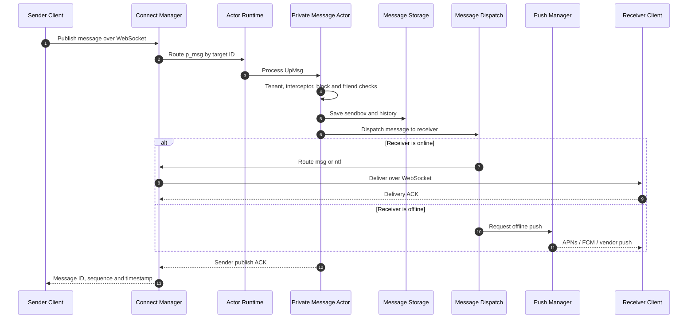
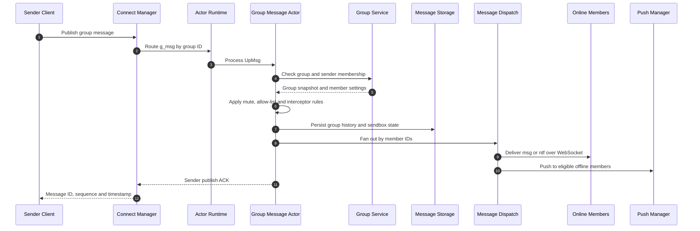

# JuggleIM Server Architecture

English | [简体中文](./architecture_zh.md)

This document explains how the open-source JuggleIM server is structured, how a message moves through the system, and which infrastructure it requires. It describes the `master` branch and the single-node community deployment. Cluster-specific behavior belongs to the professional edition and is intentionally outside this document's implementation claims.

## 1. Architecture at a glance

JuggleIM is a modular real-time messaging server built as a single Go process. HTTP and WebSocket gateways feed requests into an internal actor and RPC runtime. Domain modules own message delivery, users, groups, conversations, history, push, files, subscriptions, bots, moderation, and RTC room signaling.

The community deployment uses MySQL for required application and messaging metadata. Message-related collections can optionally use MongoDB. A local LevelDB-backed KV store is available for time-series-style internal data.

## 2. Design goals

- Keep long-lived client connections separate from server-side management APIs.
- Route work by method and target ID so stateful operations for the same user, group, or conversation have a stable execution path.
- Support synchronous queries, asynchronous commands, group routing, and broadcast through one internal RPC envelope.
- Keep domain code modular even though the community edition runs in one process.
- Allow MySQL-only deployments while supporting MongoDB for selected message workloads.
- Preserve tenant context (`app_key`) throughout request handling and message delivery.

## 3. System entry points

| Entry point | Default | Consumer | Responsibility |
| --- | ---: | --- | --- |
| Server API Gateway | `HTTP :9001` | Business backend | Users, groups, messages, conversations, history, push, moderation, and other server-side APIs |
| Navigator | `HTTP :9002` | Client SDKs | Validates the client token and returns the configured WebSocket connection address |
| Connect Manager | `WebSocket :9003` | Client SDKs | Maintains long connections, decodes Protobuf frames, routes client publications, delivers messages, and handles ACKs |
| Admin Gateway | `HTTP :8090` | Operators | Serves the admin console and administrative APIs |
| Diagnostics | `HTTP :6060` | Operators | Go `pprof`; bind or firewall this endpoint appropriately in production |

The ports are independently configurable. Production deployments should place TLS termination, access control, rate limiting, and public routing in front of these listeners.

## 4. Runtime model

### 4.1 Startup

`launcher/main.go` performs the following work in order:

1. Load configuration and initialize logging.
2. Connect to MySQL and run schema upgrades.
3. Open the optional local KVDB.
4. Initialize MongoDB collections when `msgStoreEngine: mongo` is selected.
5. Create the `gmicro` actor runtime and register node entry-point metadata.
6. Register gateway and domain actors.
7. Start HTTP, WebSocket, metrics, and background services.
8. Shut services down after receiving a termination signal.

### 4.2 Actor and RPC routing

Each service registers one or more string method names, such as `p_msg`, `g_msg`, `msg_dispatch`, `qry_convers`, or `push`. Calls use a Protobuf `RpcMessageWraper` containing the tenant, requester, target ID, QoS, sequence, message payload, and routing metadata.

The runtime supports:

- **Synchronous unicast** for request/response queries with a bounded timeout.
- **Asynchronous unicast** for commands and message delivery.
- **Grouped routing** for batches of target IDs.
- **Broadcast** for events that must reach every eligible actor.

In the community edition, `gmicro.Cluster` resolves routes to the current process. This keeps the same domain boundary and RPC contract without claiming multi-node behavior that is not present in this repository.

## 5. Service map

| Layer | Modules | Primary responsibility |
| --- | --- | --- |
| Access | `apigateway`, `navigator`, `connectmanager`, `admingateway` | REST APIs, endpoint discovery, WebSocket sessions, and operations UI |
| Messaging | `message`, `broadcast`, `botmsg` | Private messages, dispatch, broadcast, acknowledgements, bot messages, and sendbox state |
| Identity | `usermanager`, `friendmanager`, `statussubscriptions` | Users, settings, friend relationships, presence, bans, blocks, and status subscriptions |
| Conversation | `conversation`, `group`, `historymsg` | Conversations, unread state, tags, groups, membership, history, recall, read state, favorites, and merged messages |
| Extensions | `pushmanager`, `fileplugin`, `subscriptions`, `rtcroom`, `sensitivemanager`, `logmanager` | Offline push, file credentials, event subscriptions, RTC signaling, moderation, and visual logs |
| Runtime | `commons/gmicro`, `commons/bases`, `commons/imstarters` | Actor lifecycle, routing, RPC envelopes, callbacks, startup, and shutdown |
| Data | `dbcommons`, `mongocommons`, `kvdbcommons` | MySQL migrations, optional MongoDB collections, and local LevelDB storage |

Services communicate through actor method names instead of importing another service's internal implementation. Shared lookup and delivery helpers live under `services/commonservices`.

## 6. Message lifecycle

### 6.1 Private message

Important behaviors include interceptor checks, block/friend policy checks, client-message deduplication, message ID and sequence allocation, sendbox/history persistence, online delivery, offline push, and sender acknowledgement.

### 6.2 Group message

The exact fan-out and storage work depends on message flags, group settings, member settings, online state, and push configuration.

## 7. Data architecture

| Dependency | Required | Responsibility |
| --- | :---: | --- |
| MySQL 8 | Yes | Applications, credentials, users, groups, relationships, conversations, configuration, and the default message/history storage path |
| MongoDB | No | Alternative storage collections for message, history, and push workloads when `msgStoreEngine: mongo` is configured |
| Local LevelDB | No | Embedded KV and timestamp-ordered data when `kvdb.isOpen` is enabled |
| Object storage | Feature-dependent | Attachments and upload credentials through S3-compatible storage, MinIO, OSS, or Qiniu |
| Push providers | Feature-dependent | APNs, FCM, and supported Android vendor push channels |

MySQL remains required even when MongoDB is selected because application metadata, configuration, and several domain tables still use MySQL. Database changes are applied through the repository's upgrade path during startup.

## 8. Multi-tenancy and security boundaries

- `app_key` identifies a tenant and is carried through API, RPC, storage, and delivery contexts.
- `app_secret` belongs only on a trusted business backend and must never be shipped in a client application.
- Client access uses a tenant-scoped token validated by Navigator and the WebSocket connection path.
- Public deployments should terminate TLS so HTTP becomes HTTPS and WebSocket becomes WSS.
- The admin console, diagnostics endpoint, database ports, local log uploads, and storage credentials must not be exposed without network controls.
- Default local credentials are for development only and must be changed before production use.
- Security-sensitive configuration belongs in runtime configuration or a secret manager, never in the repository.

This document does not claim end-to-end encryption between chat participants. Transport encryption and any application-level content encryption must be evaluated separately for the chosen deployment and SDK configuration.

## 9. Reliability and performance characteristics

- QoS-aware acknowledgements allow clients and services to observe delivery outcomes.
- Client message IDs support duplicate-publication filtering.
- Message sequence numbers and timestamps support ordered synchronization.
- Sendbox and history paths separate delivery state from conversation history.
- Online users receive a message or lightweight notification; eligible offline users can receive push notifications.
- Actor routing serializes work around stable routing keys where the registered actor type requires it.
- RPC queries have bounded timeouts instead of waiting indefinitely.

Performance limits depend on hardware, database configuration, message shape, group size, online ratio, and enabled integrations. See the planned reproducible benchmark work in [Issue #37](https://github.com/juggleim/im-server/issues/37); marketing scale claims should be evaluated against published benchmark conditions.

## 10. Observability and operations

- Structured application logs are written under the configured log directory.
- `GET /metrics` returns the server's current performance metrics snapshot when the default HTTP mux is served by an integrated application path.
- Go `pprof` is exposed on port `6060` by the launcher.
- Root `GET` and `HEAD` handlers on API and Navigator can be used for basic process-level checks.
- Docker Compose provides a MySQL health check and starts the server after MySQL becomes healthy.

Production operators should add external health checks, log aggregation, metrics retention, alerting, backup verification, and capacity dashboards. The diagnostics port should be restricted to an operations network.

## 11. Deployment boundaries

The repository's supported quick start is a single JuggleIM process plus MySQL. MongoDB and external file/push providers are optional. The process exposes several listeners but shares one runtime, configuration, and lifecycle.

The open-source `gmicro.Cluster` implementation routes only to the current node. Multi-node discovery, routing, failover, and horizontal scaling must not be inferred from the class name alone. Refer to JuggleIM's commercial documentation for professional-edition topology and guarantees.

## 12. Extending the server

When adding a domain capability:

1. Keep the module under `services/<name>` with its actor, service, and storage boundaries.
2. Register actor method names in the module's `starter.go`.
3. Load the starter from `launcher/main.go`.
4. Use `bases.SyncRpcCall`, `bases.AsyncRpcCall`, grouped routing, or broadcast instead of importing another module's internals.
5. Preserve tenant, requester, target, QoS, sequence, and message metadata in the RPC context.
6. Add database changes through `dbcommons.Upgrade()`.
7. Update this document and the relevant message flow when a boundary or lifecycle changes.

The editable Mermaid sources are under [`docs/diagrams`](./diagrams/). Keep the source and exported overview SVG in sync.
