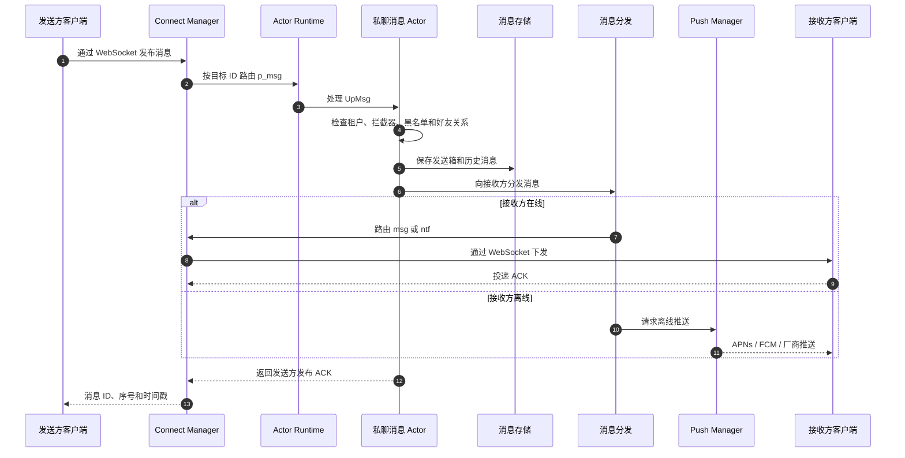
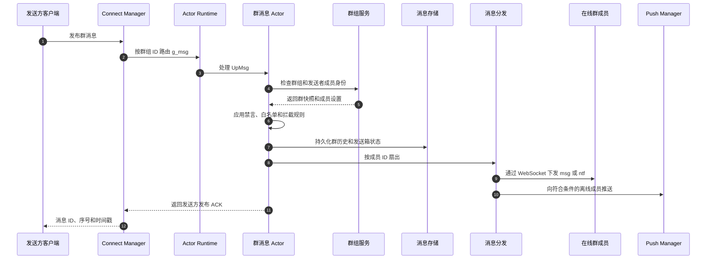

# JuggleIM Server 架构

[English](./architecture.md) | 简体中文

本文介绍 JuggleIM 开源服务端的系统结构、消息链路和运行依赖。内容对应 `master` 分支与社区版单节点部署。集群版专有行为属于专业版范围，本文不会把它描述为当前仓库已经实现的能力。

## 1. 架构总览

JuggleIM 是一个以单个 Go 进程运行的模块化实时消息服务。HTTP 和 WebSocket 网关将请求送入内部 Actor/RPC 运行时，再由领域模块负责消息投递、用户、群组、会话、历史消息、推送、文件、订阅、机器人、内容审核和 RTC 房间信令。

社区版使用 MySQL 保存必须的应用和消息元数据，也可以选择 MongoDB 保存部分消息相关集合。系统还提供基于 LevelDB 的本地 KV 存储，用于内部时间序列类数据。

## 2. 设计目标

- 将客户端长连接与服务端管理 API 分离。
- 按方法名和目标 ID 路由，使同一用户、群组或会话的有状态操作获得稳定执行路径。
- 使用统一 RPC 信封支持同步查询、异步命令、批量路由和广播。
- 社区版即使运行在单进程中，也保持清晰的领域模块边界。
- 支持仅使用 MySQL，同时允许部分消息负载切换到 MongoDB。
- 在请求处理、内部调用和消息投递过程中始终保留租户上下文 `app_key`。

## 3. 系统入口

| 入口 | 默认地址 | 使用方 | 职责 |
| --- | ---: | --- | --- |
| Server API Gateway | `HTTP :9001` | 业务后端 | 用户、群组、消息、会话、历史、推送、内容审核等服务端 API |
| Navigator | `HTTP :9002` | 客户端 SDK | 校验客户端 Token，并返回配置好的 WebSocket 连接地址 |
| Connect Manager | `WebSocket :9003` | 客户端 SDK | 维护长连接、解析 Protobuf 帧、路由客户端消息、下发消息并处理 ACK |
| Admin Gateway | `HTTP :8090` | 运维和管理员 | 提供管理后台页面与管理 API |
| Diagnostics | `HTTP :6060` | 运维人员 | Go `pprof`；生产环境应限制绑定地址或通过防火墙隔离 |

以上端口都可以独立配置。生产环境应在这些监听器之前部署 TLS、访问控制、限流和公网路由层。

## 4. 运行时模型

### 4.1 启动流程

`launcher/main.go` 按以下顺序启动：

1. 加载配置并初始化日志。
2. 连接 MySQL 并执行数据库升级。
3. 打开可选的本地 KVDB。
4. 当 `msgStoreEngine: mongo` 时初始化 MongoDB 集合。
5. 创建 `gmicro` Actor 运行时并注册节点入口元数据。
6. 注册网关和领域 Actor。
7. 启动 HTTP、WebSocket、指标采集和后台服务。
8. 收到退出信号后关闭服务。

### 4.2 Actor 与 RPC 路由

每个服务注册一个或多个字符串方法名，例如 `p_msg`、`g_msg`、`msg_dispatch`、`qry_convers` 和 `push`。调用使用 Protobuf `RpcMessageWraper`，其中包含租户、请求者、目标 ID、QoS、序号、消息负载和路由元数据。

运行时支持：

- **同步单播**：带超时的请求/响应查询。
- **异步单播**：用于命令和消息投递。
- **分组路由**：按节点处理一批目标 ID。
- **广播**：将事件发送给所有符合条件的 Actor。

社区版的 `gmicro.Cluster` 会将路由解析到当前进程。这种实现保留了领域边界和 RPC 契约，但不代表该仓库已经提供多节点能力。

## 5. 服务模块地图

| 层级 | 模块 | 主要职责 |
| --- | --- | --- |
| 接入层 | `apigateway`、`navigator`、`connectmanager`、`admingateway` | REST API、连接发现、WebSocket 会话和管理后台 |
| 消息层 | `message`、`broadcast`、`botmsg` | 私聊、消息分发、广播、ACK、机器人消息和发送箱状态 |
| 身份关系 | `usermanager`、`friendmanager`、`statussubscriptions` | 用户、设置、好友关系、在线状态、封禁、拉黑和状态订阅 |
| 会话层 | `conversation`、`group`、`historymsg` | 会话、未读数、标签、群组、成员、历史、撤回、已读、收藏和合并消息 |
| 扩展层 | `pushmanager`、`fileplugin`、`subscriptions`、`rtcroom`、`sensitivemanager`、`logmanager` | 离线推送、文件凭证、事件订阅、RTC 信令、内容审核和可视化日志 |
| 运行时 | `commons/gmicro`、`commons/bases`、`commons/imstarters` | Actor 生命周期、路由、RPC 信封、回调、启动和关闭 |
| 数据层 | `dbcommons`、`mongocommons`、`kvdbcommons` | MySQL 迁移、可选 MongoDB 集合和本地 LevelDB |

不同服务通过 Actor 方法名通信，不直接导入其他服务的内部实现。跨模块的查询与投递辅助逻辑位于 `services/commonservices`。

## 6. 消息生命周期

### 6.1 私聊消息

关键行为包括消息拦截、拉黑/好友策略、客户端消息去重、消息 ID 和序号生成、发送箱与历史持久化、在线投递、离线推送和发送方 ACK。

### 6.2 群聊消息

实际扇出与存储行为会受到消息 Flag、群设置、成员设置、在线状态和推送配置影响。

## 7. 数据架构

| 依赖 | 是否必须 | 职责 |
| --- | :---: | --- |
| MySQL 8 | 是 | 应用、密钥、用户、群组、关系、会话、配置，以及默认消息和历史存储路径 |
| MongoDB | 否 | 当配置 `msgStoreEngine: mongo` 时，为消息、历史和推送负载提供替代集合 |
| 本地 LevelDB | 否 | 当开启 `kvdb.isOpen` 时保存嵌入式 KV 和按时间戳排序的数据 |
| 对象存储 | 按功能需要 | 通过 S3 兼容存储、MinIO、OSS 或七牛处理附件和上传凭证 |
| 推送服务 | 按功能需要 | APNs、FCM 和已支持的 Android 厂商推送通道 |

即使选择 MongoDB，MySQL 仍然是必须依赖，因为应用元数据、配置和多个领域表仍然使用 MySQL。数据库变更通过启动时的升级路径执行。

## 8. 多租户与安全边界

- `app_key` 标识租户，并贯穿 API、RPC、存储和消息投递上下文。
- `app_secret` 只能保存在可信业务后端，不能打包进客户端。
- 客户端使用租户范围内的 Token，由 Navigator 和 WebSocket 连接链路校验。
- 公网部署应启用 TLS，将 HTTP 和 WebSocket 分别升级为 HTTPS 和 WSS。
- 管理后台、诊断端口、数据库端口、客户端日志上传目录和存储凭证必须受到网络访问控制。
- 默认本地账号只用于开发，生产部署前必须修改。
- 敏感配置应来自运行时配置或密钥管理系统，不能提交到仓库。

本文不声称聊天参与者之间默认具备端到端加密。传输加密和应用层内容加密需要结合实际部署和 SDK 配置单独评估。

## 9. 可靠性与性能特征

- QoS ACK 让客户端和服务能够观察投递结果。
- 客户端消息 ID 用于过滤重复发布。
- 消息序号和时间戳支持有序同步。
- 发送箱与历史消息路径将投递状态和会话历史分开处理。
- 在线用户接收完整消息或轻量通知，符合条件的离线用户可以接收推送。
- Actor 路由会根据注册类型围绕稳定路由键串行化处理。
- RPC 查询具有明确超时，不会无限等待。

性能上限取决于硬件、数据库配置、消息大小、群规模、在线比例和开启的集成能力。可复现基准测试正在 [Issue #37](https://github.com/juggleim/im-server/issues/37) 跟踪；所有规模宣传都应结合公开测试条件评估。

## 10. 可观测性与运维

- 结构化应用日志写入配置的日志目录。
- 当默认 HTTP Mux 被集成应用提供服务时，`GET /metrics` 返回当前性能指标快照。
- Launcher 在 `6060` 端口暴露 Go `pprof`。
- API 和 Navigator 的根路径 `GET`、`HEAD` 可用于基础进程检查。
- Docker Compose 为 MySQL 配置健康检查，MySQL 健康后才启动服务端。

生产环境还应配置外部健康检查、日志聚合、指标留存、告警、备份验证和容量看板。诊断端口应限制在运维网络内。

## 11. 部署边界

仓库提供的快速启动拓扑是单个 JuggleIM 进程加 MySQL。MongoDB、文件存储和推送服务均为可选。进程虽然开放多个监听端口，但共享同一套运行时、配置和生命周期。

开源版 `gmicro.Cluster` 只会路由到当前节点，不能因为类名中包含 `Cluster` 就推断其具有多节点发现、路由、故障转移或水平扩容能力。专业版拓扑和能力应以 JuggleIM 商业文档为准。

## 12. 扩展服务端

新增领域能力时：

1. 在 `services/<name>` 中保持 Actor、Service 和 Storage 边界。
2. 在模块的 `starter.go` 注册 Actor 方法名。
3. 在 `launcher/main.go` 加载 Starter。
4. 使用 `bases.SyncRpcCall`、`bases.AsyncRpcCall`、分组路由或广播，不直接导入其他模块的内部代码。
5. 在 RPC 上下文中保留租户、请求者、目标、QoS、序号和消息元数据。
6. 数据库变更通过 `dbcommons.Upgrade()` 引入。
7. 当模块边界或消息生命周期改变时，同步更新本文和相关时序图。

可编辑 Mermaid 源文件位于 [`docs/diagrams`](./diagrams/)。修改总览图后，应同步导出 SVG。
